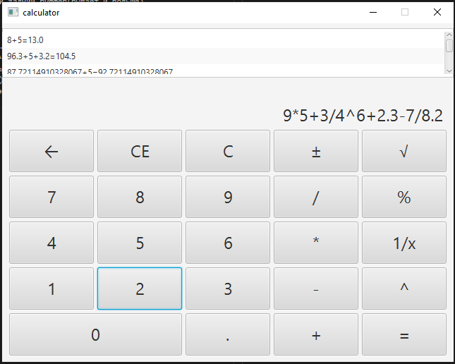
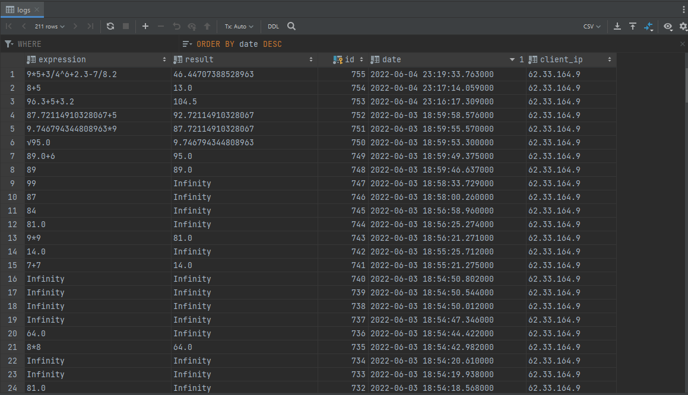

# About
In generally - it is simple Java FX application.
This calculator can parse math operations, so, the order doesnt matter.
All results are recorded by logger and sends to database
## screenshots

